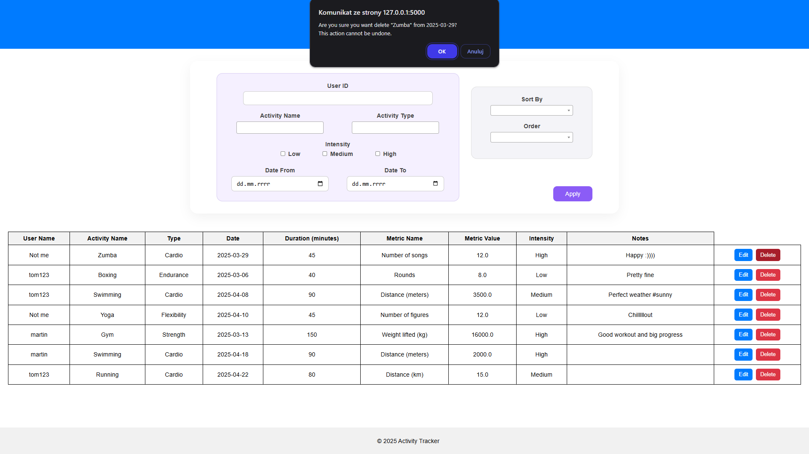

# 🏗️ Disclaimer
> 🚧 This project is under active development. Features, design, and structure are subject to change.

---

# 🏃 Activity Tracker Web App

A modern, user-friendly web application for tracking, managing, and analyzing physical activities. Ideal for individuals or teams who want to monitor progress across various exercise disciplines like cardio, strength training, or flexibility workouts.

---

## 📖 Table of Contents

- [Features](#features)
- [Screenshots](#screenshots)
- [Technologies Used](#technologies-used)

---

## ✨ Features

- Web scraping and display of current weather in Krakow
- Typing messages and sharing thoughts
- Add, update, delete, and search activity records
- Automatically assigns relevant metrics (e.g., distance, weight)
- Clean, responsive UI built with HTML, CSS, and JavaScript
- MongoDB integration for persistent data storage
- Dynamic form fields based on user selections
- Sorting and filtering according to available parameters *(in progress)*
- Visual statistics *(in progress)*
- Report generation *(in progress)*
- Downloading reports as PDF or sending to email *(in progress)*

---

## 📸 Screenshots

### 🏠 Navigation & Home

---

### ➕ Add Activity

---

### ✏️ Edit Activity

---

### ❌ Delete Activity

---

### 🔍 Manage Activities

---

## 🛠️ Technologies Used

- **Python** (Flask)
- **MongoDB** (with PyMongo)
- **HTML5 / CSS3 / JavaScript**
- **Jinja2** for templating
- **BeautifulSoup** for web scraping
- **Git** for version control
- **JSON** for message storage
